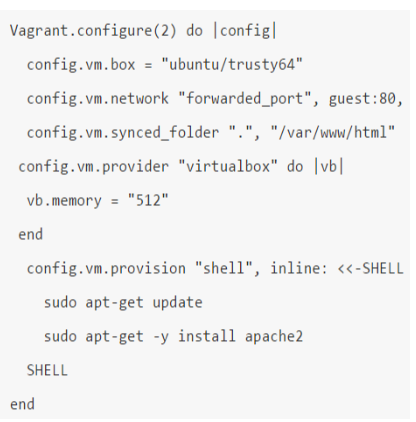
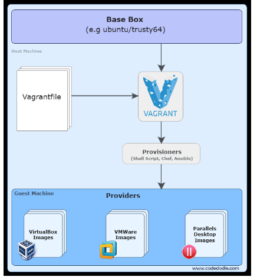

# Dokumentation M901 

## 703.1
### Vagrant

Vagrant automatisiert das erstellen und löschen von virtuelle Machinen anhand einer vagrant Datei.
Vagrant gehört zu einer Sprache die "Infrastructure as a Code" übermittelt, das soll heissen, dass man einen "Code" schreiben kann, in unserem Fall die Vagrantdatei.
Man kann auch in einem Vagrantfile mehere Virtuelle Machinen erstellen, die mit einander kommunizieren

Eine Vagrant Datei könnte dabei ungefähr so aussehen:

## Vagrant Befehle
| Vagrant Befehle    | Wirkung           |
| ------------------ | -----------------:|
| vagrant up         | Führt das Vagrant File aus |
| vagrant destroy -f | Löscht die erzeugten Daten des Vagrant Files |
| vagrant reload     | Reloaded das Vagrant File |

Wenn man dann mit Vagrant eine Vm erstellt hat, kann man mit einem Virtualizer (VirtualBox Oracle) in diese Virtuelle Machine   

Das obrige Bild beschreibt die Struktur von Vagrant. Ganz oben sieht man das Betriebssystem. Auf diesem Betriebsystem wird dann mittel einem Vagrantfile eine Virtuelle Machine erstellt, die an einem Provider (VirtualBox und co.) weitergegeben wird.

## Kapitel: 702.2 Container Usage, 1. Teil 

*Weight* 5

*Beschreibung* Kandidaten sollten in der Lage sein, mehrere Container auszuführen und zu verwalten, die zusammenwirken, um einen Dienst bereitzustellen. Dazu gehört die Orchestrierung von Docker-Containern mit Docker Compose in Verbindung mit einem bestehenden Docker Swarm Cluster sowie mit einem bestehenden Kubernetes Cluster. Dieses Ziel umfasst die Funktionen von Docker Compose Version 1.14 oder höher, Docker Swarm in Docker 17.06 oder höher und Kubernetes 1.6 oder höher.

*Tagesziele* 
* Verstehen der Architektur und des Anwendungsmodells Kubernetes
* Definition und Verwaltung einer containerbasierten Anwendung für Kubernetes, einschließlich der Definition von Deployments, Services, ReplicaSets und Pods.

*Vorgehen* Online Recherche über das Thema - Youtube Videos zum Thema schauen 

### Arbeitsergebnisse

## Deployment

Ein Deployment Controller stellt deklarative Updates für Pods und ReplicaSets zur Verfügung.

Sie beschreiben einen gewünschten Zustand in einem Deployment-Objekt, und der Deployment Controller ändert den aktuellen Zustand mit einer kontrollierten Geschwindigkeit in den gewünschten Zustand. Sie können Deployments definieren, um neue ReplicaSets zu erstellen, oder um bestehende Deployments zu entfernen und alle ihre Ressourcen mit neuen Deployments zu übernehmen.

## Services 

Eine abstrakte Möglichkeit, eine Anwendung, die auf einer Reihe von Pods läuft, freizulegen.
 als Netzwerkdienst.
Sie müssen Ihre Anwendung nicht ändern, um einen unbekannten Mechanismus zur Diensterkennung zu verwenden. Kubernetes gibt Pods ihre eigenen IP-Adressen und einen einzigen DNS-Namen für eine Reihe von Pods und kann den Lastausgleich zwischen ihnen durchführen.

## ReplicaSet

Der Zweck eines ReplicaSets ist es, einen stabilen Satz von Replikat-Pods zu erhalten, die zu einem bestimmten Zeitpunkt laufen. Daher wird es häufig verwendet, um die Verfügbarkeit einer bestimmten Anzahl identischer Pods zu gewährleisten.

## Pods

Pods sind die kleinsten einsetzbaren Recheneinheiten, die in Kubernetes erstellt und verwaltet werden können.
Eine Schote (wie in einer Schote von Walen oder Erbsenschote) ist eine Gruppe von einem oder mehreren Containern.
 (z.B. Docker-Container), mit gemeinsamem Speicher/Netzwerk und einer Spezifikation für den Betrieb der Container. Die Inhalte einer Pod werden immer gemeinsam platziert und geplant und laufen in einem gemeinsamen Kontext. Ein Pod modelliert einen anwendungsspezifischen "logischen Host" - er enthält einen oder mehrere Anwendungscontainer, die relativ eng gekoppelt sind - in einer Pre-Container-Welt, wobei die Ausführung auf derselben physischen oder virtuellen Maschine die Ausführung auf demselben logischen Host bedeuten würde.
[20:02, 8.7.2019] Michelle: ## Kapitel: 702.1 Container Usage, 1. Teil 

*Weight* 7

*Beschreibung* Die Kandidaten sollten in der Lage sein, Docker-Container zu erstellen, zu teilen und zu betreiben. Dazu gehören das Erstellen von Dockerfiles, die Verwendung einer Docker-Registry, das Erstellen und Interagieren mit Containern sowie das Verbinden von Containern mit Netzwerken und Speichermedien. Dieses Ziel umfasst den Funktionsumfang von Docker Version 17.06 oder höher. 

*Tagesziele* 
* Verstehen der Docker-Architektur
* Vorhandene Docker-Images aus einer Docker-Registry verwenden
* Erstellen Sie Dockerfiles und erstellen Sie Bilder aus Dockerfiles.
* Bedienung und Zugriff auf Docker-Container
* Container mit Docker-Netzwerken verbinden
* Verwendung von Docker-Volumes für die gemeinsame und persistente 
* Speicherung von Containern

*Vorgehen* Online Recherche über das Thema - Youtube Videos zum Thema schauen 

### Arbeitsergebnisse

Die Idee hinter Docker ist es, leichte, tragbare Container für Softwareanwendungen zu entwickeln, die auf jeder Maschine mit installiertem Docker laufen können, unabhängig vom Betriebssystem unter der Maschine, was auch die Bereitstellung erleichtert.

Dieses Konzept ist alt und stammt von Linux, aber um ein Vergleich mit der realen Welt zu machen, stellen Sie sich in Ihrem Kopf einen Container vor, die normalerweise Warenschiffe transportieren, die verschiedene Produkte enthalten.

Um Wordpress mit Docker-Compose aufzusetzen, muss man folgendes beachten: erstelle einen Ordner mit dem Namen, der den Prefix von den Containern definiert zB. «sami» dann sind die Namen sami_wordpress_1. 

##Docker Compose

Als erstes ist hier der Inhalt von docker-compose.yml 
version: '3.3'       
 
    services:			
     db:				
     image: mysql:5.7	

     volumes:			

       - db_data:/var/lib/mysql	

     restart: always	

     environment:		

       MYSQL_ROOT_PASSWORD: somewordpress	

       MYSQL_DATABASE: wordpress			

       MYSQL_USER: wordpress			

       MYSQL_PASSWORD: wordpress			

     wordpress:

     depends_on:	
       - db

     image: wordpress:latest 

     ports:			

       - "8080:80"		

     restart: always	

     environment:		

       WORDPRESS_DB_HOST: db:3306	
       WORDPRESS_DB_USER: wordpress

       WORDPRESS_DB_PASSWORD: wordpress

       WORDPRESS_DB_NAME: wordpress

    volumes:

        db_data: {}	

Die Datei speichern und folgenden Befehl ausführen

        sudo docker-compose up -d

Danach einfach auf localhost:8080/wordpress und die Installation vornehmen, die weniger als 30 Sekunden 
dauern sollte. 

#Bestehender Container benutzen
Was man jetzt problemlos eingeben kann ist folgendes, um eine statische Seite zu erzeugen 

        sudo docker run --rm prakhar1989/static-site 

Sobald “Nginx is running…” angezeigt wird, kannst du einfach Crtl+C drücken; du musst es «detached» starten 
lassen 

        sudo docker run -d -P --name static-site prakhar1989/static-site   
-d heisst, dass unser Terminal unabhängig vom Container sein wird.  
-P weist random Ports zur Applikation, durch die wir dann die Applikation finden. 
Mit folgendem Befehl findet man die Ports.  

        sudo docker port static-site 

Anstatt dass man die IP eingibt, kann man «localhost» verwenden. Bsp. localhost:»Static-site-Port» 
 
Mit diesem Befehl stoppt man den unabhängigen Container 

        sudo docker stop static-site 

Mit diesem Befehl stoppt man den unabhängigen Container 

## Dockerfile 

Aus einem Dockerfile ein Image erstellen: Wordpress aufsetzen mit einem Dockerfile 

Erstelle einen Ordner im /etc/ der «Images» heisst. Erstell dort ein File namens Dockerfile 

        cd /etc 
        sudo mkdir Images 
        sudo touch Dockerfile 
        sudo nano Dockerfile 

Gebe folgendes ins Dockerfile ein 

        FROM wordpress 
        RUN apt-get update 

Speichern. Um ein Image zu erstellen folgender Befehl eingeben 

        sudo docker build -t samiwordpress . 

Sobald es fertig ist, kann man folgendes eingeben, um den Container zu erstellen 

        sudo docker run -d -p 8089:80 –name wordpress_sami samiwordpress:latest 

Wenn jetzt

        sudo docker port wordpress_sami 

Eingegeben wird, sollte ersichtlich sein, dass der Container vor Kurzem gestartet wurde. 
 
Wenn ihr also auf die IP-Adresse des Netzwerkadapters Docker0 eingebt in den Browser, gefolgt von 8090, kommt 
ihr auf die Wordpress Setup Seite. 

##Commands

docker
Usage: docker [OPTIONS] COMMAND [ARG...]
       docker [ --help | -v | --version ]

A self-sufficient runtime for containers.

        Options:
            --config string      Location of client config files (default "/root/.docker")
        -D, --debug              Enable debug mode
            --help               Print usage
        -H, --host value         Daemon socket(s) to connect to (default [])
        -l, --log-level string   Set the logging level ("debug"|"info"|"warn"|"error"|"fatal") (default "info")
            --tls                Use TLS; implied by --tlsverify
            --tlscacert string   Trust certs signed only by this CA (default "/root/.docker/ca.pem")
            --tlscert string     Path to TLS certificate file (default "/root/.docker/cert.pem")
            --tlskey string      Path to TLS key file (default "/root/.docker/key.pem")
            --tlsverify          Use TLS and verify the remote
        -v, --version            Print version information and quit

        Commands:
            attach    Attach to a running container
            # […]   

## weitere Commands

    docker –version

This command is used to get the currently installed version of docker

 
    docker pull

This command is used to pull images from the docker repository(hub.docker.com)

    docker run

This command is used to create a container from an image

    docker ps

This command is used to list the running containers

    docker ps -a

This command is used to show all the running and exited containers

    docker exec

This command is used to access the running container

    docker stop

This command stops a running container

    docker kill

This command kills the container by stopping its execution immediately. The difference between ‘docker kill’ and ‘docker stop’ is that ‘docker stop’ gives the container time to shutdown gracefully, in situations when it is taking too much time for getting the container to stop, one can opt to kill it

    docker commit

This command creates a new image of an edited container on the local system

    docker login
This command is used to login to the docker hub repository

    docker push
 
This command is used to push an image to the docker hub repository

    docker images
This command lists all the locally stored docker images

    docker rm

This command is used to delete a stopped container

    docker rmi

This command is used to delete an image from local storage

    docker build

This command is used to build an image from a specified docker file

## Fazit und Aussicht

Es war definitiv gut wieder einen Einblick in meine Arbeiten vom M300 zu haben. Die Möglichkeiten von Docker durchzuschauen zeigt sofort, dass Docker für vieles gut ist und es vielseitig eingesetzt werden kann.
